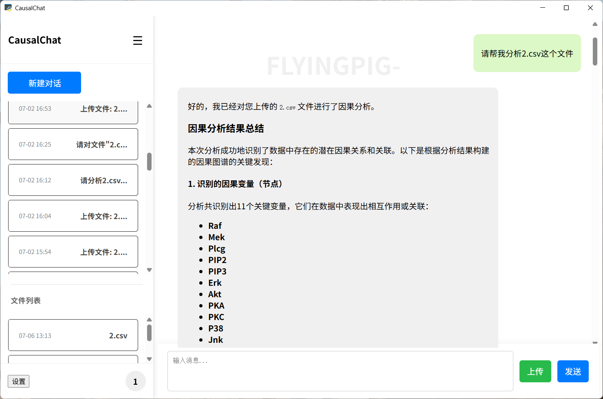
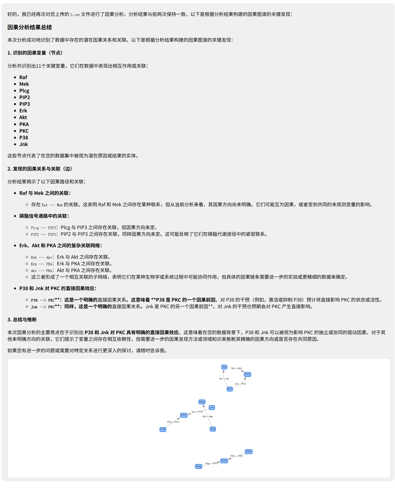

# Causal-Chat

*只需上传你的数据集，Causal-Chat 就能以对话的方式，自动帮你选用因果分析算法，并在几秒钟内生成可交互的对话面板和专业的分析报告。*

**目前正在开发中，暂时不能使用，请等待后续更新**

## 展示


## 核心优势

- **智能因果分析**: 基于大语言模型（LLM）驱动的对话式分析流程，将复杂的因果推断变得通俗易懂。用户无需深入了解算法细节，即可获得详尽、专业的因果分析报告。
- **动态交互图谱**: 分析结果以可交互的因果图谱呈现，用户可以直观地探索变量间的因果关系。当用户对结果有疑问时，可以随时追问，获得更深入的解释。
- **Lngchain架构**: langchain架构，支持良好的拓展性
- **agent智能体**: 全面支持agent智能体结构，使ai回复更加智能，对报告分析更加准确
- **模块化工具架构 (MCP)**: 采用先进的 MCP 架构，将核心对话逻辑与因果分析等工具解耦。这使得添加新工具、新算法变得轻而易举，具有极高的可扩展性。
- **RAG和知识向量库的构建**：采用专业的知识向量库查询，对专业知识有更加专业，严谨的理解。
- **安全的多用户环境**: 完整的用户注册、登录与会话管理系统，所有用户数据（聊天记录、上传文件）均通过用户ID进行严格隔离，确保数据安全。
- **跨平台桌面应用**: 通过 `pywebview` 将 Web 应用打包成独立的桌面客户端，为用户提供一致、流畅的跨平台（Windows/macOS/Linux）体验。

## 技术栈

- **后端**: Flask, Python
- **前端**: HTML, CSS, JavaScript, jQuery, Vis-network.js 
- **数据库**: MySQL
- **应用封装**: pywebview
- **核心架构**: CausalChat-MCP (Method Call Protocol)，agent，Langchian,RAG
- **AI 模型**: 支持 OpenAI 或其他兼容的 API

## 核心功能

- **文件上传**: 支持用户上传 CSV 数据集用于分析。
- **因果分析**: 可由 LLM 自动调用后端因果发现算法。
- **专业报告**：依据自构建的知识向量库，和rag检索增强生成专业的报告
- **交互式图表**: 将因果关系渲染为可交互、可缩放的动态网络图。
- **上下文理解**: LLM 具备多轮对话记忆，能够联系上下文进行分析。


## 项目使用
项目正在开发，目前还不支持直接使用，只能通过clone或者fork使用。

## windows部署

项目采用前后端分离的设计，需要同时运行后端服务和前端应用。

首先推荐创建一个环境，具体创建方式请自行查阅

1. 打开命令行工具。

2. 导航到您想要存放项目的目录。 （例如，如果您想放在 D 盘的 Projects 文件夹下，可以输入 cd /d D:\Projects）

3. 克隆仓库: 输入以下命令并按回车：

  git clone https://github.com/Heyflyingpig/AIchatbox.git
  这将在当前目录下创建一个名为 AIchatbox 的文件夹，并下载所有项目文件（包括通过 LFS 管理的大文件）。

*备选方案：您也可以在 GitHub 页面上点击 "Code" -> "Download ZIP" 下载项目的压缩包，然后手动解压。*


4.  **Python 环境**: 确保你已安装 Python 3.8+。
   
5.  **MySQL 数据库**: 你需要一个正在运行的 MySQL 8.0+ 实例。请预先创建一个数据库（例如，名为 `causal_chat_db`）并准备好其访问凭据（主机、用户名、密码）。

6.  **安装 Python 依赖**:
    克隆项目后，在项目根目录运行以下命令：
    ```bash
    pip install -r requirements.txt
    ```

### 项目配置

在首次运行前，你必须在项目根目录下创建一个 `secrets.json` 文件，用于存放所有敏感配置信息。

1.  创建 `secrets.json` 文件。
2.  将以下模板内容复制到文件中，并填入你自己的真实信息。

    ```json
    {
        "SECRET_KEY": "YOUR_FLASK_STRONG_RANDOM_SECRET_KEY",
        "API_KEY": "YOUR_LLM_API_KEY",
        "BASE_URL": "YOUR_LLM_API_BASE_URL",
        "MODEL": "YOUR_LLM_MODEL_NAME",
        "MYSQL_HOST": "localhost",
        "MYSQL_USER": "your_mysql_username",
        "MYSQL_PASSWORD": "your_mysql_password",
        "MYSQL_DATABASE": "causal_chat_db"
    }
    ```
    - `SECRET_KEY`: Flask 用于加密会话的密钥，请务必使用一个长且随机的字符串。
    - `API_KEY`, `BASE_URL`, `MODEL`: 你所使用的大语言模型服务的凭据。
    - `MYSQL_*`: 你在 **步骤 2** 中准备的数据库连接信息。
### 1. 启动数据库
需要预先安装mysql数据库
在项目根目录下打开一个终端，运行以下命令：
```bash
python database_init.py
```
### 2. 启动后端服务

在项目根目录下打开一个终端，运行以下命令：

```bash
python Causalchat.py
```

首次运行时，程序会自动连接到你在 `secrets.json` 中配置的数据库，并创建所需的表结构。你会看到 Flask 开发服务器启动的日志，它正在 `http://127.0.0.1:5001` 上监听。**请保持此终端窗口持续运行。**

### 3. 启动前端应用

再打开一个 **新的终端窗口**，同样在项目根目录下，运行以下命令：

```bash
python Run_causal.py
```

稍等片刻，一个标题为 "CausalChat" 的桌面应用窗口将会出现，并加载应用的登录界面。现在，你可以注册并开始使用了。

### 4. rag和知识库部分
目前知识库仍然在迭代，代码库中不存在该部分知识库
目前项目使用的是bge-small-zh-v1.5嵌入模型，支持txt，pdf构建，模型放置在knowledge文件夹下的models文件夹:./knowledge/models
如果需要使用自购键知识库，只需要在./knowledge/db文件夹下防放置即可

## linux部署（目前暂不支持）

在生产环境中，后端部署在云服务器上，而前端应用 (`Run_causal.py`) 在本地电脑上运行并连接到服务器。


- **代码部署**: 将项目代码同步到你的云服务器。
- **配置**: 确保服务器上的 `secrets.json` 文件配置正确，特别是数据库地址应指向生产数据库。
- **启动服务**:
    - **Linux (推荐)**: 使用 `gunicorn` 或类似的 WSGI 服务器来运行应用，以获得更好的性能和稳定性。
      ```bash
      # 示例：使用 gunicorn，监听在所有网络接口的 5001 端口
      gunicorn Causalchat:app -w 4 -b 0.0.0.0:5001
      ```
    - **Windows**: 可以直接使用 `python Causalchat.py`，或使用 `waitress` 等生产级 WSGI 服务器。
      ```bash
      # 示例：使用 waitress
      pip install waitress
      waitress-serve --host 0.0.0.0 --port 5001 Causalchat:app
      ```
- **防火墙**: 确保服务器的防火墙或安全组已开放你所使用的端口（例如 `5001`）。


## 项目结构

```
.
├── Causalchat.py         # Flask 主应用，处理 HTTP 请求、用户认证、MCP 交互
├── Run_causal.py         # pywebview 前端启动器
├── requirements.txt      # Python 依赖
├── README.md             # 项目说明
├── database_init.py      # 数据库初始化(需要自行运行)
├── secrets.json          # 配置模板 (需自行创建 secrets.json)、
├── knowledge             # 知识库
│   ├── build_knowledge.py# 构建知识库
│   ├── db                # 知识库存放位置
│   ├── models            # 嵌入模型
├── setting/              # 设置项
│   ├── Userprivacy.md    # 用户隐私协议
│   ├── manual.md         # 用户手册
├── Document/             # 文档
│   ├── Database_NOTES.md # 数据库说明
├── causal/               # 因果推断算法模块
│   └── causalachieve.py
├── CausalChatMCP/        # MCP 工具服务端
│   └── mcp_server.py
└── static/               # 前端静态文件
    ├── chat.html         # 主聊天界面
    ├── css/
    └── js/
```

## 更新日志

---
2025.5.9
- 【内容新增】：完成LLM chat框架的全构建
- 【内容新增】：统一数据库，增强安全性和规范性
- 【内容新增】：增加CSV文件上传功能
- 【内容新增】：增加文件上传的后端校验功能

---
2025.5.10
- 【内容新增】：完成MySQL数据库的构建
- 【内容新增】：将后端服务部署至服务器
- 【性能提升】：引入gunicorn，优化前后端交互模式

---
2025.5.11
- 【性能提升】：成功部署gunicorn，支持多用户并行登录
- 【内容新增】：实现Flask会话加密与多用户登录密钥检测
- 【bug修复】：修复了MySQL数据库的错误实现

---
2025.6.11
- 【内容新增】：实现MCP（Method Call Protocol）的初步演示
- 【性能提升】：构建异步任务逻辑，提升回答函数性能
   
---
2025.6.12
- 【内容新增】：实现基础的PC因果发现算法库
- 【内容新增】：连通MCP与因果库，允许LLM按需调用
- 【内容新增】：集成vis-network库，实现交互式因果图渲染
- 【内容新增】：增加LLM上下文理解功能（支持20轮对话）
- 【性能提升】：创建后台asyncio事件循环以支持异步任务
- 【内容新增】：实现历史会话中因果图的保存与加载
- 【性能提升】：优化多用户并行登录逻辑
- 【内容新增】：增加前端加载动画效果
---
2025.6.14
- 【性能提升】：分离数据库初始化脚本，提高系统健壮性

---
2025.6.15
- 【bug修复】：修复了AI回复时加载动画不消失的问题
- 【bug修复】：修复了特定场景下AI错误回复"上传成功"的问题
- 【bug修复】：修复了MCP在处理多文件上传时无响应的问题
- 【内容新增】：增加文件检查逻辑，支持同名文件更新
- 【内容新增】：优化了前端界面样式

---
2025.6.15
- 【内容新增】：重构数据库，增加归档和分区功能
- 【数据库更新内容】(Document/Database_NOTES.md)
- 【内容新增】：更新前端样式以适配新版数据库
- 【内容新增】：调整后端逻辑以适配新版数据库

---
2025.6.16
- 【内容新增】：增加会话标题可编辑功能
- 【内容新增】：增加会话标题实时预览功能
- 【内容新增】：在设置中新增操作手册与用户隐私协议

---
2025.6.17 晨
- 【内容新增】：完成后端对会话标题编辑功能的支持
- 【内容新增】：增加会话列表的删除功能，现在可以向左滑动删除会话啦
- 【内容新增】：增加模糊搜索，现在用户不需要指定文件名，也可以调用因果分析功能
- 【BUG修复】：修复了AI回复时加载动画不消失的问题
- 【BUG修复】：修复了创建新会话的时候显示错误的问题

---
2025.6.17 晚
- 【内容新增】：增加文件列表功能，现在可以查看上传的文件列表啦
- 【内容新增】：文件库设计，文件库对齐
- 【内容新增】：增加文件删除功能
- 【BUG修复】：增加文件哈希大小检测，不只是检测文件名
- 【内容新增】：css文件增加注释，方便后续维护
- 【内容新增】：增加文件引用功能，现在点击文件可以在聊天框引用啦
- 【BUG修复】：修复了文件列表滚动后内容显示不正确的问题
- 【BUG修复】：修复了按下文件名之后，清空输入框的问题
---
2025.6.21
- 【内容新增】：设置页面的md格式支持
- 【内容新增】：消息支持复制

---
2025.6.23
- 【BUG修复】：修改会话更新逻辑

---
2025.7.1
- 【BUG修复】：修复ai回复时禁用输入框逻辑

---
2025.7.6
- 【内容新增】：重置与ai交互逻辑，新增agent智能体和langchain架构，对mcp进行重新架构升级，对参数接口进行统一，现在回复是基于agent啦

---
2025.7.7
- 【内容新增】：系统完美集成了rag和mcp功能，生成报告的时候会查询知识库，生成一份更加详细的报告了
- 【内容新增】：集成langsmith，可以在后端查看具体的调用结果
- 【bug修复】：修复用户新建对话时，无论是否发送消息都创建新的会话的问题，增加延迟会话逻辑，会话等待逻辑

---
2025.7.14
- 【内容新增】：加载密匙逻辑全面更改
- 【内容新增】：全面重构agent逻辑，新增langgraph逻辑

---
2025.8.7
- 【内容新增】：全面重构agent，增加langgraph图，节点，边关系构建
- 【内容新增】：增加后处理逻辑，增加报告生成逻辑，增加预处理逻辑

---
2025.8.13
- 【内容新增】： 补充agent中文件加载节点，预处理节点部分功能实现

---
2025.8.16
- 【内容新增】： 拓展fold节点，增加数据分析内容，增加数据内容验证文件

---
2025.9.17
  - 【内容新增】： 补充fold节点，增加数据分析内容，增加数据内容验证文件。
  - 目前对于用户上传文件可以进行初步判断，对于不合理的数据进行人工干预，对于需要更改数据提出建议，后期再进行更改。用户需要补充目标变量和处理变量才可以进行因果分析。

---
2025.9.18
  - 【内容新增】： 补充预处理节点，增加数据分析内容，增加数据内容可视化，增加数据内容总结。
  - 【内容新增】： 补充rag节点，增加知识库查询功能，补充mcp调用causal-learn因果分析算法。

---
2025.9.20
  - 【内容新增】： 补充human节点，增加人机交互过程

---
2025.10.14
  - 【内容新增】： 补充后处理节点，增加后处理功能
  - 【内容新增】： 后处理节点：1. 查看是否有环路，如果存在环路，则使用LLM辅助决策进行修正。2. 查看是否有不合理边，如果存在不合理边，则使用LLM辅助决策进行修正。

---
2025.10.19
  - 【结构重置】：重构代码中人设部分
  - 【结构重置】：重构数据库连接

---
2025.10.22
  - 【bug修复】： 解决agent路由的bug问题，目前可以正常跑通

---
2025.10.23
  - 【bug修复】：修复agent中的用户暂停逻辑
  - 【bug修复】：修复agent当中的文件上传逻辑
  
--- 
2025.10.26
  - 【内容新增】：增加langgraph中的checkpoint支持,重构langgraph的节点逻辑
  - 【内容新增】：实现mysql数据库的langgraph checkpoint功能，实现同步/异步方法
  - 【内容新增】：增加inquiry_answer节点，实现对用户追问的回答
  - 【bug修复】： 修复目前节点的reducer机制，修复state中的reducer机制，实现消息记录的补充说明
  - 【bug修复】： 主程序对checkpoint的响应逻辑补充，补充config配置，修复对多次回答的逻辑缺失
  - 【内容新增】：补充Alembic数据库迁移功能

---
2025.10.28
  - 【内容重构】：重构工具执行节点，封装@task工具，支持数据库的task支持
  - 【bug修复】：重构human in loop节点，支持interrupt机制，支持用户输入的传递

---
2025.10.31
  - 【内容新增】：docker部署
  
--- 
2025.11.2
  - 【BUG修复】：修复用户注册密码加密问题，使用bcrypt进行加密
  
---
2025.11.6
  - 【内容新增】：增加思考过程气泡和详情面板，支持思考过程的展示和展开/收起
  - 【内容新增】：支持SSE流式传输节点，支持显示思考进度
  - 【内容新增】：支持ai的流式传输重构

---
2025.11.11
  - 【内容新增】：增加预处理图表支持，完善报告生成
  - 【内容新增】：数据库中支持可代替图表生成