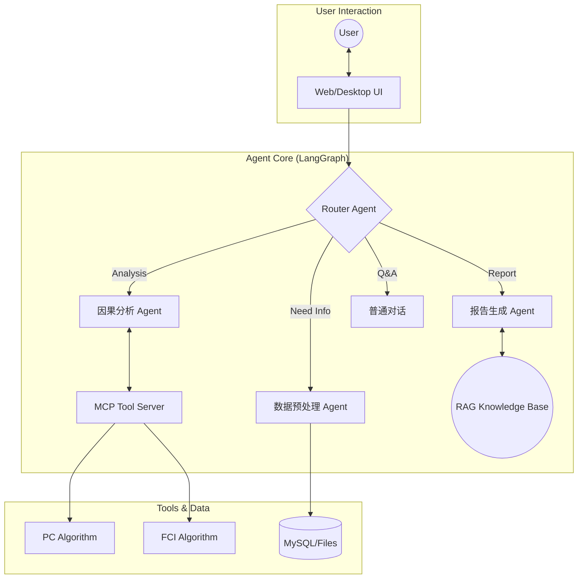

[简体中文](README.md) | [English](README_EN.md)


<p align="center">

</p>

<h1 align="center">
CausalChat
</h1>

<p align="center">
<em>新一代因果分析智能体</em>
</p>

<p align="center">
    <a href="#">
      
    </a>
    <a href="#">
      
    </a>
    <a href="#">
      
    </a>
    <a href="#">
      
    </a>
  </p>

  <br>

  <p>

*只需上传你的数据集，Causal-Chat 就能以对话的方式，自动帮你选用因果分析算法，并在生成可交互的对话面板和专业的分析报告。*

> [!IMPORTANT]
> **项目开发中**
> <br>
> 目前 CausalChat 正在进行核心架构升级,我们正在努力完善功能，**请点击右上角 Star ⭐ 关注后续更新！**

## 目录

- [目录](#目录)
- [WHAT IS CausalChat](#what-is-causalchat)
- [WHY CausalChat](#why-causalchat)
- [技术栈](#技术栈)
- [展示](#展示)
- [核心功能](#核心功能)
  - [Agent 总览](#agent-总览)
  - [预处理](#预处理)
  - [因果分析（MCP）](#因果分析mcp)
  - [知识库（RAG）](#知识库rag)
  - [后处理](#后处理)
  - [报告生成](#报告生成)
- [快速开始 | Quick Start](#快速开始--quick-start)
  - [Docker部署](#docker部署)
  - [windows部署](#windows部署)
- [贡献](#贡献)
- [Star 趋势](#star-趋势)
- [项目结构](#项目结构)
- [更新日志](#更新日志)


## WHAT IS CausalChat

**新一代因果分析智能体**: CausalChat 是一个集成了AGENT的因果分析工具，它能够自动识别因果关系，生成专业的分析报告，并提供可交互的因果图谱。
**缩减因果分析门槛**：什么是因果？为什么需要因果分析？简单来说，[因果分析](https://zh.wikipedia.org/wiki/%E5%9B%A0%E6%9E%9C%E6%8E%A8%E6%96%B7)就是对真实世界数据进行逻辑分析。

## WHY CausalChat

| 特性 | 说明 |
| :--- | :--- |
| **Agent 驱动** | 基于 LangGraph 的多智能体协作，自动路由任务，无需人工干预算法细节。 |
|  **动态图谱** | 摒弃静态图片，生成可交互的 Network 图谱，支持节点拖拽、点击追问。 |
|  **MCP 架构** | 采用 **Model Context Protocol**，将核心逻辑与工具解耦，极易扩展新算法。 |
|  **RAG 增强** | 内置因果推断领域的专业知识库，确保生成的分析报告学术性与严谨性并存。 |
## 技术栈

| 类别 | 技术组件 |
| :--- | :--- |
| **Core AI** |    |
| **Backend** |    |
| **Frontend** |    |
| **Tools** |   |
## 展示
<p align="center">
  

</p>
<p align="center">
  
</p>

## 核心功能

CausalChat 的整体因果分析流程可以抽象为：**用户上传数据 → 预处理与数据体检 → 因果结构学习 → 后处理与质量提升 → 报告与可视化输出**。下面按模块进行说明。

### Agent 总览


- **Router Agent**：根据用户意图在「预处理 / 因果分析 / 知识库问答 / 报告生成」等节点之间自动路由，无需用户关心底层算法。
- **Causal Agent**：负责与 MCP 因果算法工具交互（如 PC、FCI 等），完成因果结构学习与干预效应估计的核心推理。
- **Writer Agent**：结合因果结果与 RAG 知识库，自动撰写结构化专业报告（背景、方法、结果、结论与局限性）。
- **Chat Agent**：面向一般问答与解释型对话，为非专业用户提供自然语言解释与操作指引。

### 预处理
*进行基本的数据建模，对数据进行可视化分析，并为后续因果分析做「体检与筛选」*

- **数据概览**：统计数据集的行数、列数和所有字段名，生成统一的表结构摘要，帮助快速理解数据规模与字段含义。
- **列级体检与类型推断**：逐列分析缺失率、唯一值、是否常数列，自动识别连续变量、分类变量、时间变量、疑似 ID 等，并给出每一列在因果分析中的适用性评级（如 *excellent / good / warning*）。
- **质量诊断与因果友好度评估**：汇总整体缺失率，标记高缺失列和常数列，识别高基数分类、疑似 ID 等问题字段，并按适用性分组出「优先用于因果分析」的候选变量列表。
- **可视化摘要**：通过直方图、箱线图、相关性热力图等可视化方式，辅助发现明显异常值和潜在共线性问题。

### 因果分析（MCP）
*基于 MCP（Model Context Protocol）快速迭代因果算法*

- **可插拔算法框架**：通过 MCP 将因果发现与估计算法以「工具」形式解耦，便于在不改动 Agent 主逻辑的前提下扩展/更换算法库。
- **当前支持**：
  - PC 算法（基于条件独立检验的因果结构学习）。
- **规划中**：
  - FCI 等含潜在混杂的结构学习算法；
  - 因果效应估计（ATE/CATE）与反事实分析等模块。

### 知识库（RAG）
*通过嵌入论文与书籍构建因果推断领域知识库，为报告和问答提供专业支撑*

- **嵌入模型**：目前采用 `bge-small-zh-v1.5` 作为中文向量化模型，兼顾性能与效果。
- **知识来源**：使用大量因果推断相关书籍与论文的 PDF / TXT 文档构建，涵盖经典因果图论、干预推断、工具变量、面板因果等主题。
- **典型能力**：
  - 在生成报告时，自动检索相关理论和方法描述，为结论补充严谨的文献背景；
  - 支持面向初学者的「概念解释」，例如“什么是混杂变量”“为什么需要随机试验”等。

### 后处理
*对因果图进行后处理，包括环路检测、边合理性评估等，提高因果结构的可解释性与可靠性*

- **环路检测与修正**：检查学习得到的因果图中是否存在违背 DAG（有向无环图）假设的环路；若发现异常，则调用 LLM 辅助判断合理的断边方案，给出修正建议。
- **边评估与置信度分析**：对每一条因果边进行强度或置信度评估，结合数据统计特征和领域常识，对明显不合理的边进行标记与修正建议。
- **结构约束与业务先验融合**：在后处理阶段支持引入业务先验（如「变量 A 不可能被 B 因果影响」），从而得到更符合领域知识的因果图。

### 报告生成
*根据后处理结果生成面向业务方与研究者的专业报告，并配套交互式可视化*

- **自动生成结构化报告**：围绕「分析背景 → 数据概况 → 方法说明 → 因果发现 → 结论与建议 → 局限性」等章节自动撰写自然语言报告。
- **交互式因果图谱**：基于 vis-network 等前端组件生成可交互的因果图，支持节点拖拽、缩放、查看变量说明、点击追问等操作。

## 快速开始 | Quick Start
### Docker部署
当前项目已经提供了完整的 `Dockerfile`，支持通过 Docker 运行后端服务，但暂未在公网镜像仓库发布官方镜像。
如果你已安装 Docker，可以在本地根据下面的步骤自行构建并运行镜像。


1. 安装docker并且gitclone项目
```bash
git clone https://github.com/Heyflyingpig/CausalChat
```

2. 创建.env文件,并在文件中键入以下值
```bash
# Flask 应用密钥（用于会话加密等）
SECRET_KEY=

# API 基础URL（OpenAI官方或第三方兼容接口）
BASE_URL=
MODEL=

# OpenAI API 密钥或兼容 API 的密钥
API_KEY=
# Docker环境：使用服务名 'mysql'
# 本地开发：使用 'localhost' 或 '127.0.0.1'
MYSQL_HOST=mysql

# 数据库用户名
MYSQL_USER=

MYSQL_ROOT_PASSWORD=
# 数据库密码
MYSQL_PASSWORD=

# 数据库名称
MYSQL_DATABASE=

# LangSmith API 密钥(不强制)
LANGCHAIN_API_KEY=

# LangSmith 项目名称（不强制）
LANGCHAIN_PROJECT=

```
3. 在项目根目录运行docker-compose
```bash
docker-compose up -d
```
> [!IMPORTANT]
> **知识库仍然在构建，所以知识库查询功能暂不可用**


### windows部署

项目采用前后端分离的设计，需要同时运行后端服务和前端应用。

首先推荐创建一个环境，具体创建方式请自行查阅

1. 打开命令行工具。

2. 导航到您想要存放项目的目录。 （例如，如果您想放在 D 盘的 Projects 文件夹下，可以输入 cd /d D:\Projects）

3. 克隆仓库: 输入以下命令并按回车：

  git clone https://github.com/Heyflyingpig/CausalChat
  这将在当前目录下创建一个名为 CausalChat 的文件夹，并下载所有项目文件。

*备选方案：您也可以在 GitHub 页面上点击 "Code" -> "Download ZIP" 下载项目的压缩包，然后手动解压。*


4.  **Python 环境**: 确保你已安装 Python 3.11+。

5.  **MySQL 数据库**: 你需要一个正在运行的 MySQL 8.0+ 实例。请预先创建一个数据库（例如，名为 `causal_chat_db`）并准备好其访问凭据（主机、用户名、密码）。

6.  **安装 Python 依赖**:
    克隆项目后，在项目根目录运行以下命令：
    ```bash
    pip install -r requirements.txt
    ```

7. 项目配置

在首次运行前，你必须在项目根目录下创建一个 `.env` 文件，用于存放所有敏感配置信息。

-   创建 `.env` 文件。
-   将以下模板内容复制到文件中，并填入你自己的真实信息。

    ```bash
    # Flask 应用密钥（用于会话加密等）
    SECRET_KEY=

    # API 基础URL（OpenAI官方或第三方兼容接口）
    BASE_URL=
    MODEL=

    # OpenAI API 密钥或兼容 API 的密钥
    API_KEY=
    # Docker环境：使用服务名 'mysql'
    # 本地开发：使用 'localhost' 或 '127.0.0.1'
    MYSQL_HOST=mysql

    # 数据库用户名
    MYSQL_USER=

    MYSQL_ROOT_PASSWORD=
    # 数据库密码
    MYSQL_PASSWORD=

    # 数据库名称
    MYSQL_DATABASE=

    # LangSmith API 密钥(不强制)
    LANGCHAIN_API_KEY=

    # LangSmith 项目名称（不强制）
    LANGCHAIN_PROJECT=

    ```

8. 启动数据库
需要预先安装mysql数据库
在项目根目录下打开一个终端，运行以下命令：
```bash
python database_init.py
alembic upgrade head
```
 Database/database_init.py 负责创建数据库和基础表结构；Alembic 迁移脚本负责在此基础上做结构升级。
 - 全新安装时先运行  Database/database_init.py，再执行 alembic upgrade head；
 - 已有历史数据的环境只需要执行 alembic upgrade head 即可。

9. 启动后端服务

在项目根目录下打开一个终端，运行以下命令：

```bash
python Causalchat.py
```

首次运行时，程序会自动连接到你在 `secrets.json` 中配置的数据库，并创建所需的表结构。你会看到 Flask 开发服务器启动的日志，它正在 `http://127.0.0.1:5001` 上监听。**请保持此终端窗口持续运行。**

10. 启动前端应用

再打开一个 **新的终端窗口**，同样在项目根目录下，运行以下命令：

```bash
python Run_causal.py
```

稍等片刻，一个标题为 "CausalChat" 的桌面应用窗口将会出现，并加载应用的登录界面。现在，你可以注册并开始使用了。

11. rag和知识库部分
> [!IMPORTANT]
> **知识库仍然在构建，所以知识库查询功能暂不可用**

## 贡献
欢迎提交 Issue 和 Pull Request！

1. Fork 本项目

2. 新建 Feat_xxx 分支

3. 提交代码

4. 新建 Pull Request
   
## Star 趋势

[](https://star-history.com/#Heyflyingpig/CausalChat&Date)


## 项目结构

```
.
├── Causalchat.py           # Flask 入口
├── Run_causal.py           # 桌面端启动入口（pywebview）
├── requirements.txt        # 完整依赖
├── requirements-base.txt   # 基础依赖（docker/生产使用）
├── Dockerfile
├── docker-compose.yml
├── docker-compose.prod.yml
├── README.md               # 项目说明
├── database_init.log       # 数据库初始化日志
├── app/                    # Flask 应用主目录（Blueprint 结构）
│   ├── __init__.py         # 创建 Flask app，注册蓝图
│   ├── db.py               # 数据库会话与连接封装
│   ├── main/               # 通用页面相关路由
│   ├── auth/               # 登录、注册等认证相关路由
│   ├── chat/               # 聊天 & 会话相关路由与服务
│   ├── files/              # 文件上传/管理相关路由
│   └── static/             # 前端静态资源
│       ├── chat.html       # 主聊天界面
│       ├── css/
│       ├── js/
│       └── generated_graphs/ # 因果图等生成图像
├── Agent/                  # 因果分析与智能体核心逻辑
│   ├── causal/             # 底层因果发现算法
│   ├── causal_agent/       # langgraph/agent 状态、节点定义
│   ├── Processing/         # 数据预处理、折叠验证、可视化
│   ├── Postprocessing/     # 后处理
│   ├── Report/             # 报告生成逻辑
│   ├── knowledge_base/     # RAG 知识库
│   │   ├── build_knowledge.py
│   │   ├── db/             # 向量知识库存储
│   │   └── models/         # 嵌入模型
│   └── tool_node/          # MCP 工具节点封装（task、rag 调用等）
├── Database/               # 数据库初始化与迁移逻辑
│   ├── database_init.py    # 数据库初始化脚本
│   ├── agent_connect.py    # Langgraph checkpoint 相关数据库支持
│   └── migrations/         # Alembic 迁移脚本
├── config/                 # 全局配置
│   └── settings.py
├── setting/                # 用户可见文档
│   ├── manual.md           # 用户手册
│   └── Userprivacy.md      # 用户隐私协议
├── openspec/               # 项目规范与变更说明（内部开发用）
```

## 更新日志

---
2025.5.9
- 【内容新增】：完成LLM chat框架的全构建
- 【内容新增】：统一数据库，增强安全性和规范性
- 【内容新增】：增加CSV文件上传功能
- 【内容新增】：增加文件上传的后端校验功能

---
2025.5.10
- 【内容新增】：完成MySQL数据库的构建
- 【内容新增】：将后端服务部署至服务器
- 【性能提升】：引入gunicorn，优化前后端交互模式

---
2025.5.11
- 【性能提升】：成功部署gunicorn，支持多用户并行登录
- 【内容新增】：实现Flask会话加密与多用户登录密钥检测
- 【bug修复】：修复了MySQL数据库的错误实现

---
2025.6.11
- 【内容新增】：实现MCP（Method Call Protocol）的初步演示
- 【性能提升】：构建异步任务逻辑，提升回答函数性能

---
2025.6.12
- 【内容新增】：实现基础的PC因果发现算法库
- 【内容新增】：连通MCP与因果库，允许LLM按需调用
- 【内容新增】：集成vis-network库，实现交互式因果图渲染
- 【内容新增】：增加LLM上下文理解功能（支持20轮对话）
- 【性能提升】：创建后台asyncio事件循环以支持异步任务
- 【内容新增】：实现历史会话中因果图的保存与加载
- 【性能提升】：优化多用户并行登录逻辑
- 【内容新增】：增加前端加载动画效果
---
2025.6.14
- 【性能提升】：分离数据库初始化脚本，提高系统健壮性

---
2025.6.15
- 【bug修复】：修复了AI回复时加载动画不消失的问题
- 【bug修复】：修复了特定场景下AI错误回复"上传成功"的问题
- 【bug修复】：修复了MCP在处理多文件上传时无响应的问题
- 【内容新增】：增加文件检查逻辑，支持同名文件更新
- 【内容新增】：优化了前端界面样式

---
2025.6.15
- 【内容新增】：重构数据库，增加归档和分区功能
- 【数据库更新内容】(Document/Database_NOTES.md)
- 【内容新增】：更新前端样式以适配新版数据库
- 【内容新增】：调整后端逻辑以适配新版数据库

---
2025.6.16
- 【内容新增】：增加会话标题可编辑功能
- 【内容新增】：增加会话标题实时预览功能
- 【内容新增】：在设置中新增操作手册与用户隐私协议

---
2025.6.17 晨
- 【内容新增】：完成后端对会话标题编辑功能的支持
- 【内容新增】：增加会话列表的删除功能，现在可以向左滑动删除会话啦
- 【内容新增】：增加模糊搜索，现在用户不需要指定文件名，也可以调用因果分析功能
- 【BUG修复】：修复了AI回复时加载动画不消失的问题
- 【BUG修复】：修复了创建新会话的时候显示错误的问题

---
2025.6.17 晚
- 【内容新增】：增加文件列表功能，现在可以查看上传的文件列表啦
- 【内容新增】：文件库设计，文件库对齐
- 【内容新增】：增加文件删除功能
- 【BUG修复】：增加文件哈希大小检测，不只是检测文件名
- 【内容新增】：css文件增加注释，方便后续维护
- 【内容新增】：增加文件引用功能，现在点击文件可以在聊天框引用啦
- 【BUG修复】：修复了文件列表滚动后内容显示不正确的问题
- 【BUG修复】：修复了按下文件名之后，清空输入框的问题
---
2025.6.21
- 【内容新增】：设置页面的md格式支持
- 【内容新增】：消息支持复制

---
2025.6.23
- 【BUG修复】：修改会话更新逻辑

---
2025.7.1
- 【BUG修复】：修复ai回复时禁用输入框逻辑

---
2025.7.6
- 【内容新增】：重置与ai交互逻辑，新增agent智能体和langchain架构，对mcp进行重新架构升级，对参数接口进行统一，现在回复是基于agent啦

---
2025.7.7
- 【内容新增】：系统完美集成了rag和mcp功能，生成报告的时候会查询知识库，生成一份更加详细的报告了
- 【内容新增】：集成langsmith，可以在后端查看具体的调用结果
- 【bug修复】：修复用户新建对话时，无论是否发送消息都创建新的会话的问题，增加延迟会话逻辑，会话等待逻辑

---
2025.7.14
- 【内容新增】：加载密匙逻辑全面更改
- 【内容新增】：全面重构agent逻辑，新增langgraph逻辑

---
2025.8.7
- 【内容新增】：全面重构agent，增加langgraph图，节点，边关系构建
- 【内容新增】：增加后处理逻辑，增加报告生成逻辑，增加预处理逻辑

---
2025.8.13
- 【内容新增】： 补充agent中文件加载节点，预处理节点部分功能实现

---
2025.8.16
- 【内容新增】： 拓展fold节点，增加数据分析内容，增加数据内容验证文件

---
2025.9.17
  - 【内容新增】： 补充fold节点，增加数据分析内容，增加数据内容验证文件。
  - 目前对于用户上传文件可以进行初步判断，对于不合理的数据进行人工干预，对于需要更改数据提出建议，后期再进行更改。用户需要补充目标变量和处理变量才可以进行因果分析。

---
2025.9.18
  - 【内容新增】： 补充预处理节点，增加数据分析内容，增加数据内容可视化，增加数据内容总结。
  - 【内容新增】： 补充rag节点，增加知识库查询功能，补充mcp调用causal-learn因果分析算法。

---
2025.9.20
  - 【内容新增】： 补充human节点，增加人机交互过程

---
2025.10.14
  - 【内容新增】： 补充后处理节点，增加后处理功能
  - 【内容新增】： 后处理节点：1. 查看是否有环路，如果存在环路，则使用LLM辅助决策进行修正。2. 查看是否有不合理边，如果存在不合理边，则使用LLM辅助决策进行修正。

---
2025.10.19
  - 【结构重置】：重构代码中人设部分
  - 【结构重置】：重构数据库连接

---
2025.10.22
  - 【bug修复】： 解决agent路由的bug问题，目前可以正常跑通

---
2025.10.23
  - 【bug修复】：修复agent中的用户暂停逻辑
  - 【bug修复】：修复agent当中的文件上传逻辑

---
2025.10.26
  - 【内容新增】：增加langgraph中的checkpoint支持,重构langgraph的节点逻辑
  - 【内容新增】：实现mysql数据库的langgraph checkpoint功能，实现同步/异步方法
  - 【内容新增】：增加inquiry_answer节点，实现对用户追问的回答
  - 【bug修复】： 修复目前节点的reducer机制，修复state中的reducer机制，实现消息记录的补充说明
  - 【bug修复】： 主程序对checkpoint的响应逻辑补充，补充config配置，修复对多次回答的逻辑缺失
  - 【内容新增】：补充Alembic数据库迁移功能

---
2025.10.28
  - 【内容重构】：重构工具执行节点，封装@task工具，支持数据库的task支持
  - 【bug修复】：重构human in loop节点，支持interrupt机制，支持用户输入的传递

---
2025.10.31
  - 【内容新增】：docker部署

---
2025.11.2
  - 【BUG修复】：修复用户注册密码加密问题，使用bcrypt进行加密

---
2025.11.6
  - 【内容新增】：增加思考过程气泡和详情面板，支持思考过程的展示和展开/收起
  - 【内容新增】：支持SSE流式传输节点，支持显示思考进度
  - 【内容新增】：支持ai的流式传输重构

---
2025.11.11
  - 【内容新增】：增加预处理图表支持，完善报告生成
  - 【内容新增】：数据库中支持可代替图表生成

---
2025.11.16
  - 【内容新增】：优化报告样式

---
2025.11.21
  - 【重构】：重构Agent目录关系，增强结构可读性，修改模块内部导入路径，修改目录层级关系,修改引用关系
  - 【重构】：重构flask框架，增加blueprint，增加app目录，修改causalchat主文件，适配目前APP文件目录，修改模块内部导入路径
  - 【bug修复】：修复docker由于目录重置导致的问题，修改目录关系


---
2025.11.26
  - 【内容新增】：完善MCP机制，支持动态选择不同算法
  - 【内容新增】：新增olc算法支持
