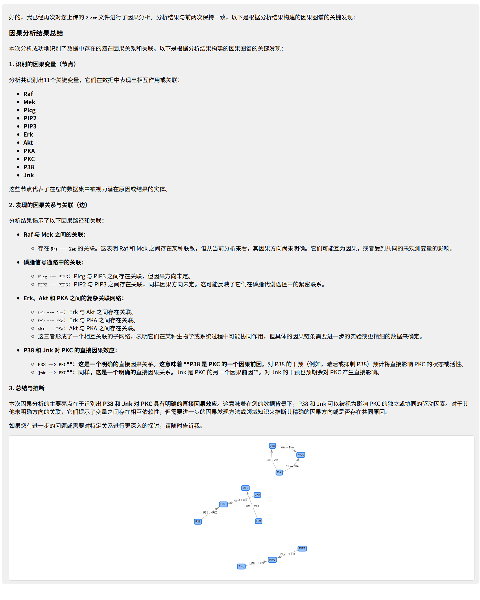

[English](README_EN.md) | [简体中文](README.md)

<p align="center">
  
</p>

<h1 align="center">
CausalChat
</h1>

<p align="center">
  <em>Next-generation causal analysis agent</em>
</p>

<p align="center">
    <a href="#">
      
    </a>
    <a href="#">
      
    </a>
    <a href="#">
      
    </a>
    <a href="#">
      
    </a>
  </p>

<br>

*Upload your dataset, and CausalChat will automatically select suitable causal analysis algorithms for you, generate an interactive dialogue interface, and produce a professional analysis report.*

> [!IMPORTANT]
> **Project in active development**
> We are upgrading the core architecture of CausalChat. Features are evolving quickly. **Please Star the repo to follow future updates.**

## Table of Contents

- [Table of Contents](#table-of-contents)
- [What is CausalChat](#what-is-causalchat)
- [Why CausalChat](#why-causalchat)
- [Tech Stack](#tech-stack)
- [Showcase](#showcase)
- [Core Capabilities](#core-capabilities)
  - [Pre-processing](#pre-processing)
  - [Causal Analysis (MCP)](#causal-analysis-mcp)
  - [Knowledge Base (RAG)](#knowledge-base-rag)
  - [Post-processing](#post-processing)
  - [Report Generation](#report-generation)
- [Quick Start](#quick-start)
  - [Docker Deployment](#docker-deployment)
  - [Windows Deployment](#windows-deployment)
- [Contributing](#contributing)
- [Project Structure](#project-structure)
- [Star History](#star-history)
- [Changelog](#changelog)

## What is CausalChat

**A new generation causal analysis agent.** CausalChat integrates multiple agents built on LangGraph to perform end-to-end causal analysis on tabular data.

You only need to upload your data. CausalChat will:

- Inspect and profile your dataset.
- Discover causal structures.
- Perform post-processing and quality checks.
- Generate interactive causal graphs and a structured, human-readable report.

## Why CausalChat

| Feature | Description |
| :--- | :--- |
| **Agent-driven** | Multi-agent orchestration based on LangGraph. Tasks are automatically routed; you do not need to handle algorithm details manually. |
| **Dynamic causal graphs** | Instead of static images, CausalChat renders interactive network graphs. You can drag nodes, zoom, and click to inspect details. |
| **MCP-based architecture** | Uses **Model Context Protocol (MCP)** to decouple core logic from tools, making it easy to extend new algorithms. |
| **RAG enhanced** | A domain-specific knowledge base for causal inference is integrated to ensure the generated reports are rigorous and well grounded. |

## Tech Stack

| Category | Components |
| :--- | :--- |
| **Core AI** | LangChain, LangGraph, OpenAI-compatible LLMs |
| **Backend** | Flask, MySQL, Alembic |
| **Frontend** | HTML5, JavaScript, PyWebview |
| **Tools** | Docker, Git |

## Showcase

<p align="center">
  
</p>
<p align="center">
  
</p>

## Core Capabilities

The overall pipeline of CausalChat can be summarized as:

**Upload data → Pre-process & data health check → Causal structure learning → Post-processing & quality enhancement → Report & visualization.**

### Pre-processing

- **Data overview**: Count rows, columns, and field names to quickly summarize table structure.
- **Column-level profiling & type inference**: Detect missing rate, unique values, constant columns; infer continuous, categorical, time-like, ID-like columns, and rate their suitability for causal analysis.
- **Quality diagnosis**: Summarize overall missingness, mark high-missing or constant columns, and identify problematic fields.
- **Visual summaries**: Histograms, boxplots, correlation heatmaps, etc., to reveal outliers and collinearity.

### Causal Analysis (MCP)

- **Pluggable algorithm framework**: Through MCP, causal discovery and estimation algorithms are wrapped as "tools" and can be swapped or extended without changing the Agent logic.
- **Currently supported**:
  - PC algorithm for causal structure learning based on conditional independence tests.
- **Planned**:
  - FCI and other algorithms with latent confounders.
  - Causal effect estimation (ATE/CATE) and counterfactual analysis.

### Knowledge Base (RAG)

- **Embedding model**: Uses `bge-small-zh-v1.5` as the current Chinese embedding model, balancing speed and performance.
- **Knowledge sources**: Books and papers on causal inference (PDF/TXT), covering graphical models, intervention analysis, IV, panel causal analysis, etc.
- **Typical abilities**:
  - Retrieve relevant theory when generating reports to provide academic background.
  - Explain fundamental concepts for beginners (e.g., "What is a confounder?").

### Post-processing

- **Cycle detection and repair**: Check whether the learned graph violates the DAG assumption; if cycles appear, LLM-assisted suggestions are used to break edges.
- **Edge evaluation and confidence analysis**: Evaluate strength or confidence of each edge, mark suspicious ones, and provide adjustment suggestions.
- **Business constraints integration**: Allow domain priors such as "A cannot be caused by B" to refine the final graph.

### Report Generation

- **Automatic structured reports**: Generate reports with sections like background, data overview, methods, findings, conclusions, and limitations.
- **Interactive causal graph**: Use frontend components such as vis-network to render a graph that supports drag, zoom and click.

## Quick Start

Here is a brief guide. For more detailed, Chinese step-by-step instructions (including full `.env` templates), please refer to `README.md`.

### Docker Deployment

1. Clone the repository:

   ```bash
   git clone https://github.com/Heyflyingpig/CausalChat
   cd CausalChat
   ```

2. Create a `.env` file in the project root and fill in environment variables such as `SECRET_KEY`, `API_KEY`, `MYSQL_HOST`, `MYSQL_USER`, `MYSQL_PASSWORD`, `MYSQL_DATABASE`, etc.

3. Start the services:

   ```bash
   docker-compose up -d
   ```

> [!IMPORTANT]
> The knowledge base is still being built, so RAG-based query features are temporarily limited.

### Windows Deployment

1. Ensure you have **Python 3.11+** and **MySQL 8.0+** installed.
2. Clone the repository or download and extract the ZIP.
3. Install Python dependencies in the project root:

   ```bash
   pip install -r requirements.txt
   ```

4. Create a `.env` file in the project root (same fields as in the Docker section above).
5. Initialize the database and run Alembic migrations:

   ```bash
   python Database/database_init.py
   alembic upgrade head
   ```

6. Start the backend service:

   ```bash
   python Causalchat.py
   ```

7. In another terminal, start the desktop frontend:

   ```bash
   python Run_causal.py
   ```

## Contributing

Contributions via Issues and Pull Requests are welcome.

1. Fork the repository.
2. Create a feature branch, such as `feat_xxx`.
3. Commit your changes.
4. Open a Pull Request.

## Project Structure

```text
.
├── Causalchat.py           # Flask entrypoint
├── Run_causal.py           # Desktop entrypoint (pywebview)
├── requirements.txt        # Full dependencies
├── requirements-base.txt   # Base dependencies (docker/production)
├── Dockerfile
├── docker-compose.yml
├── docker-compose.prod.yml
├── README.md               # Chinese README
├── README_EN.md            # English README (this file)
├── app/                    # Flask app (Blueprint structure)
├── Agent/                  # Causal analysis and agent logic
├── Database/               # DB initialization and migrations
├── config/                 # Global configuration
├── setting/                # User-facing docs
└── openspec/               # Internal project specs
```

## Star History

[](https://star-history.com/#Heyflyingpig/CausalChat&Date)

## Changelog

For a detailed and up-to-date changelog (including daily development notes), please see the Chinese README: `README.md`.

